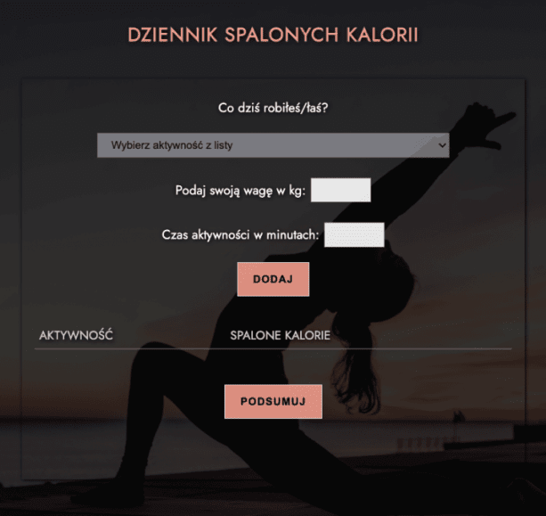

# Calorie calculator

Calculator measuring the number of calories burned per day, depending on the activity and its intensity.

Live demo: [https://paulaami.github.io/calorie-calculator/](https://paulaami.github.io/calorie-calculator/)

## Table of Contents
* [Technologies Used](#technologies-used)
* [Screenshots](#screenshots)
* [Setup](#setup)

## Technologies Used

- HTML 5
- CSS 3
- SASS 1.34.1
- Javascript 

## Screenshots

## Setup
Live demo: [https://paulaami.github.io/calorie-calculator/](https://paulaami.github.io/calorie-calculator/)

